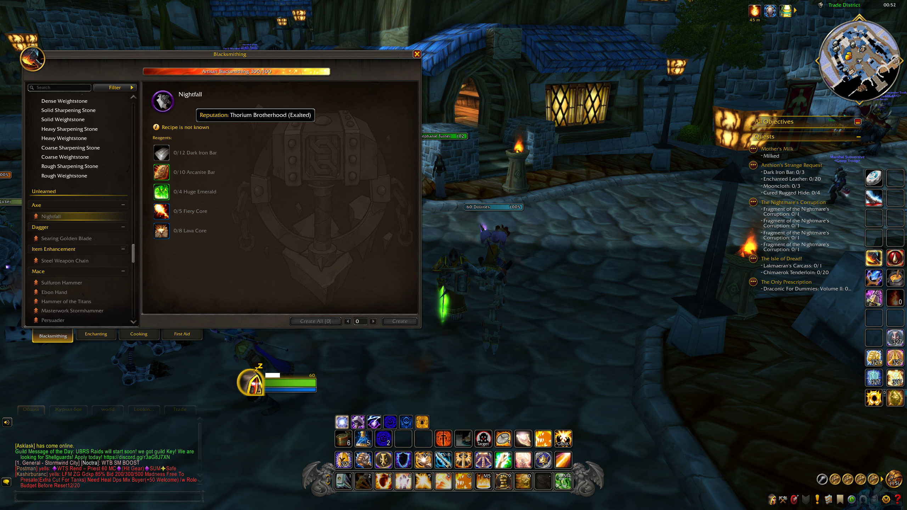
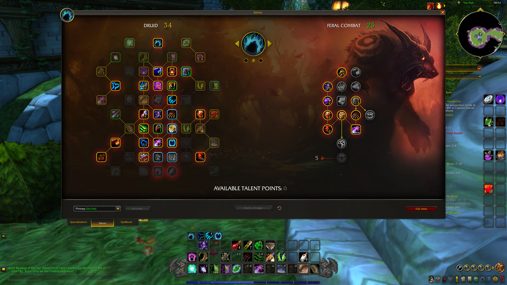
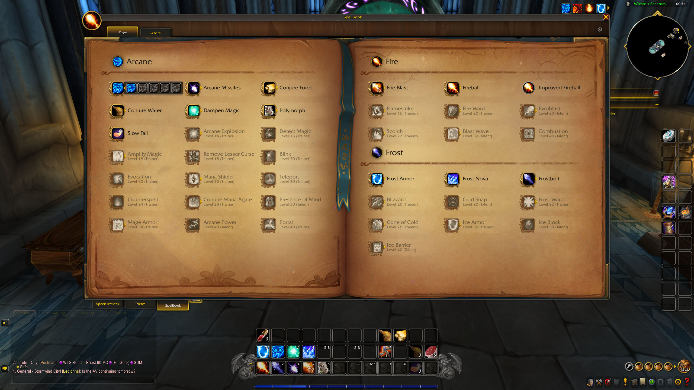
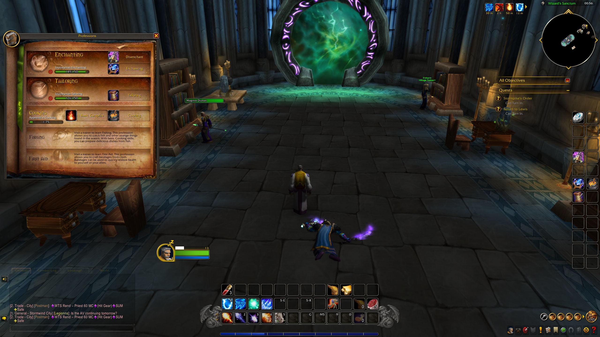
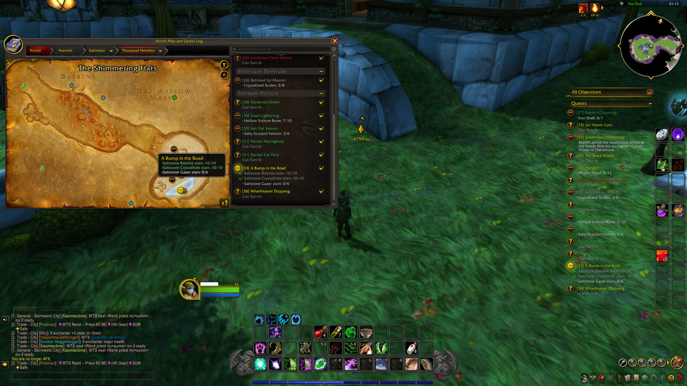
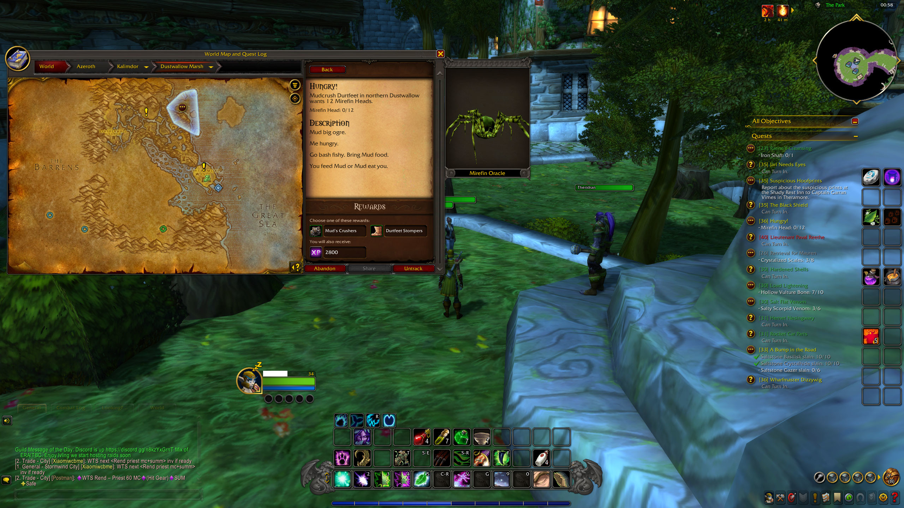
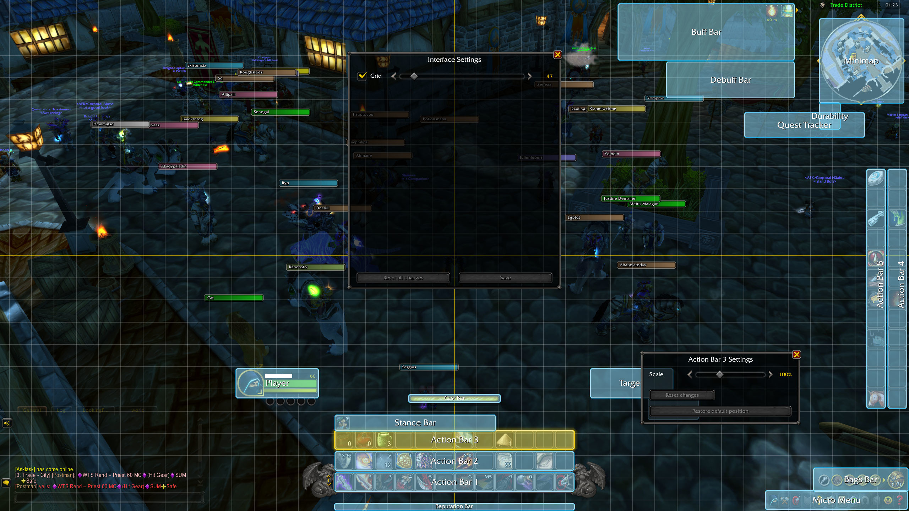

# ModernUI

ModernUI (MUI) attempts to recreate the modern retail World of Warcraft interface (Dragonflight / Midnight) on the **Classic Era** `1.15.x` client as faithful as possible.

> [!WARNING]
> This is a **huge** addon and almost certainly still has bugs. I'll fix what I can, when I can — but I burned out building it, so I **can't promise consistent or timely support**. Use at your own risk.

> [!NOTE]
> ModernUI is written **entirely in Lua** — no FrameXML (`.xml`) files; every frame is built in code.

## Screenshots

 

 

 

## Compatibility

- **Game versions:** Classic Era, Hardcore, and Season of Discovery only.
- **Language:** English. There are no translations and no localization support at the moment.
- **Other addons:** **Not compatible with other full UI overhauls** (ElvUI and similar). Running ModernUI alongside another total-conversion UI will break things. Also, not advised to use with Questie since the addon has it's own quest-helper system. Other smaller, single-purpose addons are generally fine.

## TODO (ordered by priority)

- [ ] Bug fixes - as they're reported.
- [ ] Modularity - the addon was developed with modularity in mind, but the functionality to toggle modules in-game is to be done.
- [ ] Reskin more frames - character panel, vendors, dialog frames, etc. 
- [ ] Edit Mode - more options and customizations, e.g. custom ActionBars layouts.
- [ ] Settings - more addon customization options.
- [ ] Port other functionality - achievements, collection, guidebook.
- [ ] Localization - the addon was not built with localizations in mind, needs big refactor.
- [ ] TBC+ port - compatibility with anniversary realms.

## Thanks

- **Blizzard Entertainment** — for the original UI art and design this recreates.
- **DragonflightUI** — for the reference, inspiration and some clever UI tricks.
- **Questie** — for the quest data behind the tracker and map features.

## License

Released under the **GPL-3.0-or-later** license.
